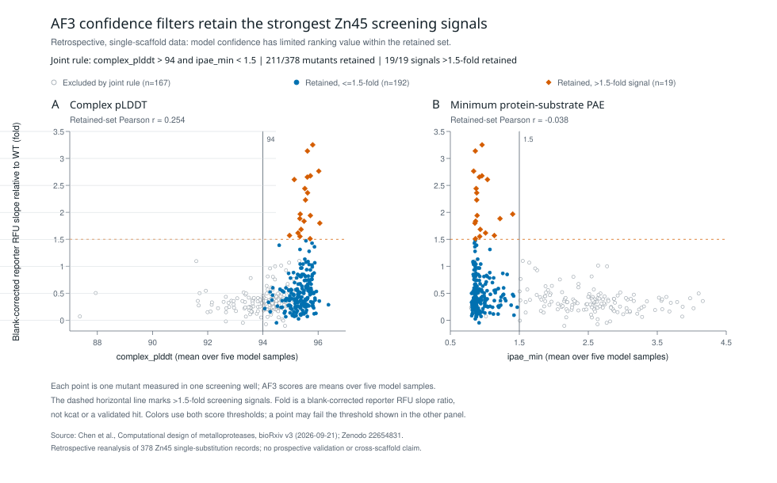

# Fixed-bond protease mechanism and evidence

**TDPn3 now has a source-bound chemical-to-protein map at
`ALQSSWG/MMGML`.** The exact published enzyme sequence is linked to the
authors' passing monomer and phosphorus-containing analogue representatives and
notebook-selected enzyme–substrate prediction, their catalytic groups, native
structural templates and measured
cleavage contexts. This is exposed research evidence from the September 21,
2026 [Chen et al. v3 preprint](https://www.biorxiv.org/content/10.1101/2025.11.20.689622v3.full)
and its [author archive](https://zenodo.org/records/22654831), outside canonical
Atlas admission. Published experiments are not project-run experiments;
computational predictions are not observed productive catalysis.

The [source-derived design input](design_input/README.md) now carries the
G7–M8 bond into the authors' starting motif and public RFD3 configuration.
Native chemical parsing and generation remain unexecuted. Three author peptide
windows were resolved to this same absolute bond. The next computational step
is the prepared [10-residue/12-residue RF3 comparison](window_check/README.md),
which tests substrate-window transfer with the enzyme sequence held constant.

## What can be transferred

The native-template [atom and geometry record](native_role_geometry.json)
connects chemical roles across two deposited inhibitor complexes. Aminopeptidase
N (4QHP) supplies the authors' catalytic groups; a separate AF3 prediction of
astacin supplies the substrate/guide-strand arrangement. Deposited astacin 1QJI
is an inhibitor complex, **not** that predicted enzyme–substrate state.

| Chemical role | TDPn3 author model | Aminopeptidase N 4QHP, author chain A | Astacin 1QJI, author chain A |
| --- | --- | --- | --- |
| First Zn histidine ligand | H146 NE2 | H293 NE2 | H92 NE2 |
| Second Zn histidine ligand | H150 NE2 | H297 NE2 | H96 NE2 |
| Third Zn ligand | E45 carboxylate | E316 carboxylate | H102 imidazole |
| Proposed general base/acid | E147 | E294 | E93 |
| Proposed oxyanion donor | Y78 OH | Y377 OH | Y149 OH |

The third metal ligand illustrates why a shared role does not imply identical
ligand chemistry. The source's first 4QHP residue list says E293; its atom
alignment list and the deposit identify E294. The record preserves the conflict
and separates the source's E316 OE2 alignment atom from the nearer Zn-contacting
OE1 atom. Native Tyr CZ–OH–inhibitor-O angles independently reproduce the
reported 108.7° and 109.8°; these are three-heavy-atom angles, not O–H···O angles.

Tyrosine identity and a short contact are insufficient as universal catalytic
rules. The source's Zn44 Tyr-to-Phe substitution slightly improves activity;
its proposed donor orientation differs from the responsive designs. Such
perturbations qualify a role constraint rather than being discarded as
exceptions. Activity changes across other scaffolds do not establish that an
individual TDPn3 contact causes specificity.

The [same-sequence astacin comparison](astacin_tyr149_state_role_relation.json)
also shows why roles need chemical-state context. In substrate-free 1AST,
Tyr149 OH is a deposited Zn coordination partner at 2.540 Å. In inhibitor-bound
1QJI it is 4.998 Å from Zn and 2.679 Å from the inhibitor oxygen. The two crystals
support different state-conditioned contacts, not a reaction trajectory or an
experimentally observed simultaneous motif. The exact deposited coordinate
files for this comparison, 4QHP and 11DU are retained under [native/](native/).

## Model identity includes the selected state

[Model provenance](author_model_provenance.json) records exact 187-residue
Table S4 identity, archive member offsets, CRCs and hashes. One of 65 inspected
candidate groups matched TDPn3; this is not an exhaustive archive search. The
four initial coordinate files preserve the original PDB bytes and retain the
author's CC BY 4.0 attribution. Three additional passing analogue predictions
are retained for the sample-sensitivity check below.

The [saved notebook evidence](author_model_selection.json) identifies ES
**seed 1, sample 3** in `df_complex_pass`. The visualization directory also
contains sample 0 because the copy operation used `df_complex_all`. Directory
membership and sequence equality therefore do not identify a selected pose.
The notebook is retained as inert source evidence; its execution history was
not reconstructed or rerun.

| Coordinate diagnostic | Selected ES sample 3 | Unselected ES sample 0 |
| --- | ---: | ---: |
| Zn–represented-water O distance | 1.878 Å | 1.296 Å |
| Zn–Gly7 carbonyl O distance | 2.947 Å | 3.317 Å |
| Represented-water O–Gly7 carbonyl C distance | 2.943 Å | 2.635 Å |

These differences change which model supports the authors' design constraints;
they are not measured reaction barriers or a new activity predictor. The ES
model represents assay-peptide residues 1–10, omitting M11–L12. In the analogue
model, one `pts` residue represents the G7–M8 pair, so subsequent residue numbers
shift. These contexts must remain explicit when transferring contacts. The modeled
G10 terminal OXT–Thr132 contact is absent from the internal assay-peptide G10;
that particular contact must not become a full-peptide recognition constraint.
Carboxylate oxygen atom-name swaps likewise must not be interpreted as physical
misalignment without checking chemically equivalent atom correspondences.

The [TDPr3 crystal identity check](tdpr3_crystal_identity.json) supplies a
separate experimental state. In 11DU, the 184-residue enzyme entity matches
Table S4 TDPr3 except for **E126Q**, while the manuscript calls the mutant E45Q
and a methods passage says E32Q. No numbering transform is established. No Zn
atom is resolved. The source interprets the bound peptide as a cut-4 register,
different from TDPr3's intended cut 5 and product assignments at cuts 3 and 5.
This mutant structure is not productive wild-type geometry or a zinc-affinity
measurement.

The [R19–S5 sensitivity result](r19_s5_state_sensitivity.json) **withdraws a
candidate explanation rather than promoting a mutation**. Comparing selected
ES3 with analogue0 initially suggested that an Arg19–Ser5 contact was lost in
the analogue. The other three saved passing analogue samples retain that
contact at 2.410–2.477 Å and preserve the ES-like Ser5 rotamer. Sample0 is the
alternate rotamer, so this pair does not establish preferential ES stabilization.
The four predictions are not physical population fractions. Recompute all 114
stored contact/angle values from the six original model files with
`python3 tools/research_lanes/protease_retargeting/measure_contact_sensitivity.py`.

## What the assays establish

The [target comparison](target_comparison.json) preserves assay doses,
substrate identity, source conflicts, exact enzyme sequences, kinetic values,
controls and missingness.

| Selected construct | Intended cut after peptide residue | Cleavage/product evidence |
| --- | --- | --- |
| TDPr3, TDP reporter | 5 | Two product masses support cuts 5 and 3 |
| TDPn3, TDP reporter | 7 | One listed C-product mass supports cut 7; cut 3 is an additional author slash annotation |
| TDPn3, purified full-length TDP-43 | 7 | Cut 7 assigned in monomeric and oligomeric preparations of one target |
| SAAc8, SAA reporter | Not explicitly assigned | Reporter kinetics and restricted-panel preference; no bond-specific MS assignment |
| AbetaF3, A-beta reporter | Not explicitly assigned | Reporter kinetics and restricted-panel preference; no bond-specific MS assignment |

The [earlier fixed-target record](fixed_target_evidence.json) is preserved.
Its TDPn3 cuts-3-and-7 entry records the authors' annotation; the new comparison
clarifies that the row does not contain independent mass evidence for both
cuts. No detection limit, exhaustive exclusion of secondary cleavage or
product-fraction estimate is inferred.

TDPr3 retains preference for its original substrate. Results text attributes
improved target preference to TDPn3, but Fig. 5b's caption names TDPr3. The
archive's `tdpA3` experiment uses the TDPn3 methods dose, but lacks an exact
alias-to-sequence mapping, so the identity conflict remains open. TDPn3 and
TDPr3 panel methods used 0.5 and 6 µM enzyme, respectively. Uncalibrated reporter
fluorescence also prevents quantitative cross-reporter catalytic ratios.

A strict feasibility check now closes the proposed cross-target intended-bond
comparison on the retained primary data. **Zero target systems qualify.** TDPn3
has an explicit intended bond and product-mass support, but its specificity-panel
alias is not sequence-resolved and its reporter responses are not calibrated to
molar cleavage. SAAc8 and AbetaF3 have exact enzyme and peptide sequences but no
reported intended slash position or product-mass bond assignment; their ED9
panel doses are also not explicit. TDPr3 is a second enzyme on the same TDP
target, not a second target, and supports two cleavage products. The structured
eligibility record and exact reopen condition are retained in
`target_comparison.json`. Do not select a computational specificity score from
these inputs; reopen only with product-verified bonds and matched, calibrated
rates for at least two distinct targets.

A separate public-source search found one compact panel that does meet the
pre-compute eligibility rule without repairing or reopening the retained design
paper. Packer, Rees and Liu's evolved TEV L2F study supplies two exactly defined
protease constructs and two exact synthetic substrates in one calibrated HPLC
assay. The resulting four cells contain three fitted kinetic positives and one
explicitly censored negative: wild-type TEV S219V produced no detectable
HPLVGHM product after 30 minutes at 1 micromolar enzyme and 2 millimolar
substrate, with a 1 nanomolar product detection limit. Synthetic product
standards bind the intended ENLYFQ/S and HPLVGH/M bonds to the HPLC readout, and
full-length IL-23 LC-MS independently supports the HPLVGH/M cut.

The frozen source record is [tev_l2f_discrimination.json](tev_l2f_discrimination.json).
It is an **exposed four-cell calibration challenge**, not an untouched holdout
or broad benchmark. Its defensible future question is whether a score recovers
the protease-by-substrate interaction: L2F gains measurable target cleavage
without losing native-substrate activity. It cannot establish cross-family
generalization, de novo design success or zinc-protease transfer. Larger qPISA,
MMP-FRET and MSP-MS panels each miss either per-peptide product/bond verification
or calibrated negatives, so they remain method templates rather than appended
labels. The source search stops here unless a future computation first requires
a larger panel and states a new eligibility rule.

The subsequent [scoring-feasibility decision](tev_l2f_scoring_feasibility.json)
closes method selection on this tetrad before an arbitrary score is run. The
wild-type/HPLVGHM cell is a nondetection under a stronger fixed-dose check, not
a fitted kinetic datum, so there is no symmetric continuous 2-by-2 efficiency
interaction. A defensible future score can use only the ordinal interaction
`G_target > 0` and `J = G_target - G_native > 0`; it cannot impute the censored
cell. A protease-independent motif baseline has zero interaction by construction,
whereas a protease-specific positional baseline is already trained on exposed
WT/L2F specificity profiles. The strongest public structure-aware comparator,
PGCN, likewise includes WT and L2F labels and does not release the source
Rosetta complexes needed to reproduce a deterministic HPLVGHM graph. One
exposed tetrad therefore cannot fairly choose between these methods. No score
was run, and heterogeneous cells must not be appended post hoc to rescue the
comparison.

The follow-up [PGCN TEV prospective audit](pgcn_tev_prospective_audit.json)
separates a useful prospective library-enrichment result from a clean
method-selection benchmark. A pretrained PGCN guided the combinatorial library
before YESS, and the 19 released clones use new exact protease identities.
However, those exact clones were selected after cleaved/uncleaved FACS outcomes,
the release omits the exact TEV train/validation/test membership, and no aligned
sequence-baseline predictions are released for the 19 cases. The tag-loss YESS
endpoint establishes broad binary reporter cleavage rather than product mapping
to the intended Q/A bond. This route therefore stops without model execution:
retain the qualitative library-enrichment evidence, but do not call the 19
clones a frozen intended-bond prospective benchmark or use them to choose PGCN
over a sequence baseline.

The bounded follow-on
[public panel survey](public_bond_resolved_panel_survey.json) identifies one
new, materially stronger candidate. Choi et al.'s version-3 de novo
cysteine-protease preprint, posted on
2026-09-21, reports 13 active designs from a 69-design cohort, supplies protein
and plasmid sequences, reports intended-site product masses and deposits six
structures. The completed
[qualification audit](choi_v3_benchmark_qualification.json) stops this
all-in-one benchmark route. Accessible primary evidence does not expose a
lossless 69-row enzyme/substrate/outcome/model join or cohort-wide quantitative
negative calibration; the six structures are a positive-enriched validation
subset. The 13/69 outcome was already public in version 1 in November 2025,
and the cognate campaign has no matched noncognate cross-target matrix. The
version-3 prose does support intended-site LC-MS for all 13 reported positives,
but that does not turn qualitative negatives into calibrated measurements or
measure programmable specificity. No model was run. Reopen only with a public
hashed source bundle that resolves the named cohort and input gaps; a clean
prospective specificity claim also requires a previously unexposed cohort and
matched cross-target panel. The next route is a narrower, explicitly
reporter-level sequence-generalization question on an already-public exact-pair
dataset, not a weakened bond-resolved claim.

That route has now been qualified and narrowed further in the
[Huber reporter audit](huber_reporter_benchmark_qualification.json). The
published ML panel contains one TEVp-I scaffold, six mutable protease positions
and 20 ENLYFQX output heads; substrate sequence is not a model input. Its fixed
1,000-variant test is drawn from 1,625 fully measured high-read AB variants and
is already exposed. It therefore cannot support a new prospective, family- or
substrate-held-out claim. Within one campaign the recorder supplies useful
quantitative negatives, but AUC values are normalized against screen-specific
inactive controls, retain a binding contribution and do not localize the cut.

Do not repeat the spent random split. The stronger remaining question uses the
separate TEVp-0 single-mutant by 134 single-mutant-substrate matrix, held within
one reporter/control campaign. A future preregistration may compare a simple
additive row-plus-column model with interaction-aware alternatives under
two-axis blocked folds fixed before scoring. Stop if exact construct/control
provenance cannot be retained or interaction information fails to beat the
additive baseline on every frozen fold. Any success remains retrospective
reporter generalization, not intended-bond cleavage or de novo design.

SAAc8 and AbetaF3 kinetic values are explicitly marked as figure
transcriptions, not independently refitted raw-data results. Campaign sizes
48, 113, 14 and 34 do not supply hit counts or hit thresholds. The selected
full-length lead cannot become a 1/113 success-rate estimate. No endogenous-cell
cleavage, proteome-wide specificity, Problem 8 completion or Atlas design
advantage is established.

## What the mutant dataset resolves

The [Zn45 reconstruction](zn45/zn45_activity_score_analysis.json) joins
378 single-substitution screening wells to five AF3 model samples per variant.
It independently reproduces the retained author progress-data checkpoints and
the 19-member retest list. The authors purified variants and normalized total
protein concentration; active fractions are not established. Each mutant has
one screening well, so model samples and timepoints are not assay replicates.

Using means over the five model samples, the source rule of complex pLDDT >94
and minimum protein–substrate PAE <1.5 Å retains **211/378 variants and all 19
screening signals above 1.5-fold parent**. Within those 211 variants, Pearson
correlations with the reporter slope ratio are 0.254 for pLDDT and −0.038 for
minimum interface PAE. Confidence is useful for filtering this dataset, while
fine ranking remains weak. These retrospective screening results are not
prospective hit rates or turnover constants.



[Download the figure as PDF](zn45/figure/zn45_confidence_screen_scatter.pdf).
The analysis preserves three consequential source-code distinctions: the
executed slope window is 360–720 s despite a 540–900 s comment; the heatmap
overwrites repeated model rows rather than averaging them; and per-chain
pLDDT fields slice an atom-level vector with residue counts. Those per-chain
fields are not used as biological measurements. The main complex pLDDT field
is an atom-level mean, and `ipae_min` is the minimum of the two directed
protein–substrate minimum-PAE entries.

The [perturbation relation](zn45/perturbation_transfer.json) distinguishes the
designed oxyanion donor Y122 from an added substrate contact Y152: losing the
former reduces activity, while some replacements of the latter improve it.
The [energy/preorganization comparison](zn45/zn45_energy_preorganization_link.json)
connects the source's 30-fold Zn45-to-v2 turnover gain to its proposed ensemble
preorganization explanation. The truncated cluster calculation changes the
reported barrier only from 17.3 to 17.1 kcal/mol; it is not a quantitative
explanation of that gain. MD geometry is a mechanistic hypothesis, not an
independently validated rate predictor.

The [resulting scientific decision](research_decision.json) prioritizes a
measured counterexample: Y152F gives 0.627-fold parent signal while Y152I gives
2.764-fold, and both pass all five confidence-filter samples. Removing the same
hydroxyl group is insufficient to predict improvement. These single-well
signals do not establish opposite turnover effects. Matched WT/F/I kinetics,
protein-competence checks and product identity would separate a turnover effect
from a recognition or preparation effect. The proposed R19 experiment is
deferred. A static WT/F/I model comparison stopped before acquisition because
the cached partial archive index lacks F coordinates; absence from that index
is not absence from the complete archive. No new enzyme or laboratory experiment
was produced by this work.

## Use the records

The [constraint relation](tdpn3_constraint_relation.json) declares the joins
between chemical role, model atom, state, native correspondence and measured
outcome. The ordinary Python query contains no enzyme-specific dispatch or
activity predictor:

```sh
python3 tools/research_lanes/protease_retargeting/query_constraint_relation.py --role oxyanion_stabilizing_tyrosine
python3 tools/research_lanes/protease_retargeting/query_constraint_relation.py --recognition
python3 tools/research_lanes/protease_retargeting/query_constraint_relation.py --contrast oxyanion_donor_versus_added_substrate_contact
```

Running `measure_author_models.py` with Python and NumPy regenerates the derived
`model_measurements.json` beside the script after checking the four model hashes.
Reproduce the mutant join with Python, NumPy and pandas (write results to a
separate directory to preserve the saved evidence):

```sh
python3 tools/research_lanes/protease_retargeting/zn45/reconstruct_zn45_activity.py --out-dir /tmp/zn45-reproduction
```

The six files under `zn45/source/` are exact retained author files, attributed
to Chen et al. and the CC BY 4.0 Zenodo deposit. Author notebooks and helper code
are inert evidence; the reconstruction does not execute them. The figure's
script uses ReportLab. The independent raw-data match establishes compatibility
with the saved notebook checkpoints, not byte identity with the notebook's
unpublished `Book2.csv` path or reconstruction of every intermediate step.

A direct query also recovers target-specific assay commitments:

```sh
python3 - <<'PY'
import json
from pathlib import Path
root = Path('tools/research_lanes/protease_retargeting')
comparison = json.loads((root / 'target_comparison.json').read_text())
for construct in comparison['constructs']:
    print(construct['construct'], construct['intended_bond'])
print(comparison['cross_target_conclusion']['bond_specific_recognition'])
PY
```

The useful result is a reusable relation between chemical role, exact atom,
model/experimental state and measured outcome, including contacts that should
not be transferred. A competent direct-source workflow can also recover these
facts; superiority of Atlas remains a separate research hypothesis. Protected
registries, frozen kernels and benchmark claims are unchanged. The current
handoff owns the next consequential research action.
